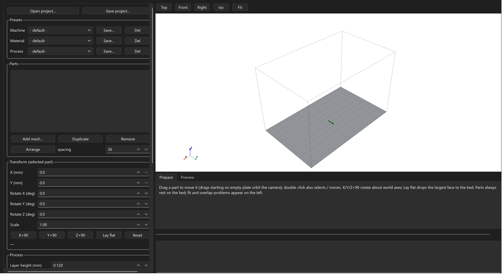
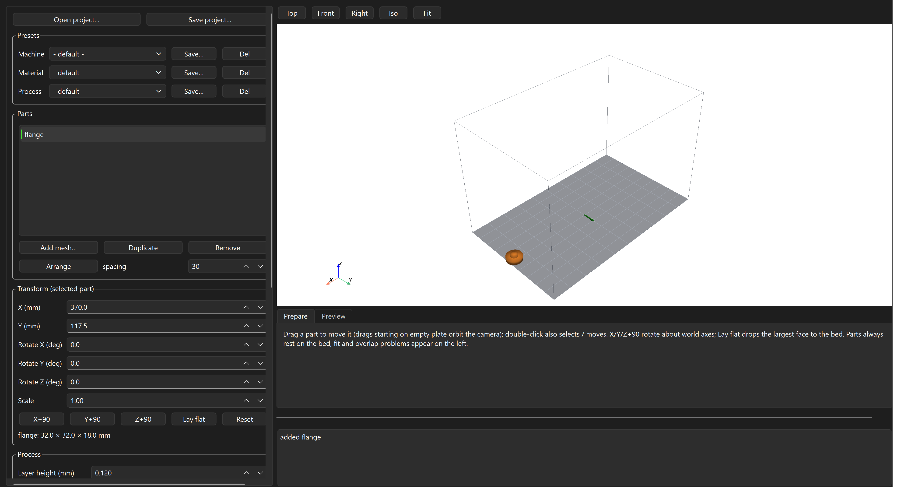
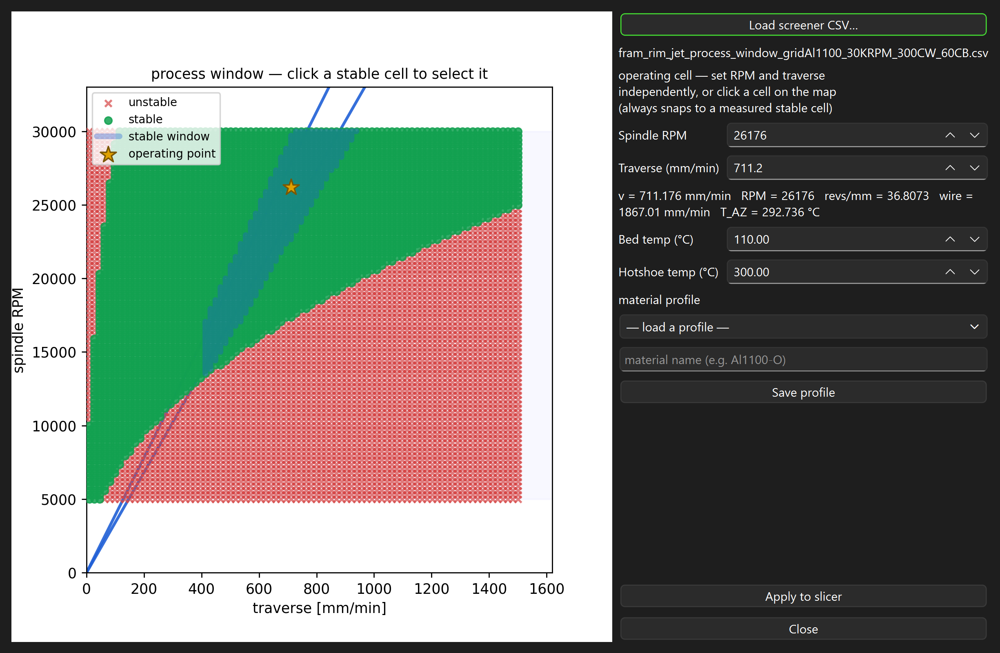
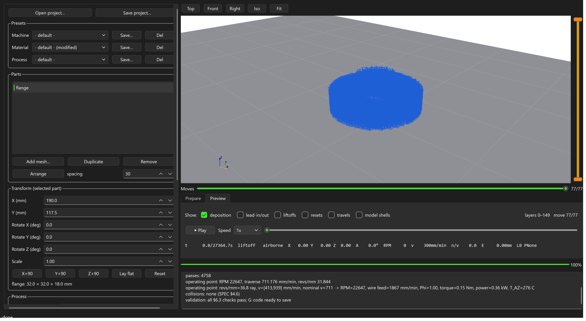
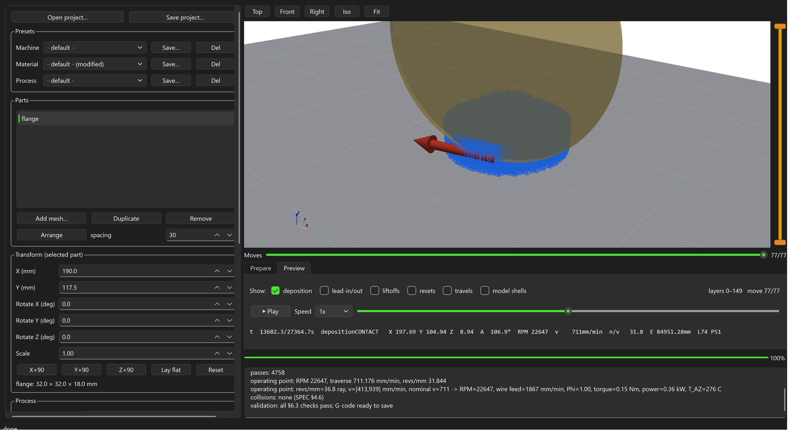

# Rotoforge Studio — User Manual

*For the Rotoforge AFRB (additive friction rotational bonding) wire-deposition
machine. Manual snapshot 2026-07-03; screenshots are captures of the real
application slicing a real part against a real FRAM process-window export.*

---

## 1. What Rotoforge Studio is

Rotoforge Studio turns a 3D mesh into RepRapFirmware G-code for the Rotoforge
AFRB machine: X, Y, Z motion, the rotary wheel axis `A`, and the wire feeder
`E`. It is not a filament slicer — deposition happens by friction between a
spinning wheel and fed wire, which imposes hard rules a normal slicer does not
have:

* **No grinding** — a wheel in contact must always be moving fast enough AND
  feeding wire; anything else removes material instead of adding it.
* **All dwells airborne** — the spindle settles and stabilizes only while
  lifted.
* **Tangential tool** — the wheel always faces its direction of travel; curves
  are limited by how fast the axis can slew and by its usable angular range.
* **The wire never retracts** — pass separation is a mechanical cut.
* **Constant revs/mm within a pass** — RPM and traverse speed stay fixed for
  the whole pass and only change airborne, between passes.

The part you should trust: **the G-code emitter re-proves every one of these
rules on the final output.** If any check fails, the studio shows a validation
error and refuses to produce G-code. A red "VALIDATION FAILED" message is the
safety system working, not the program breaking.

**The workflow:**

> **Import mesh → Load process window (material) → Pick settings → Slice →
> Inspect preview / simulation → Save G-code**

---

## 2. Starting the studio

* **One-file executable:** double-click `RotoforgeSlicer.exe` (or the
  *Rotoforge Studio* desktop shortcut). The first ~30 seconds are silent while
  the bundle unpacks — do not launch it twice. Windows SmartScreen may warn on
  an unsigned build: choose *More info → Run anyway*.
* **From a source checkout:** `python -m rotoforge_slicer.studio`.



The window has three regions:

| Region | Contents |
|---|---|
| **Left panel** (scrollable) | Project open/save, Presets, Parts list, Transform, Process settings, Advanced parameters, process-window and CSV buttons, Slice / Save G-code |
| **Viewport** (top right) | The build plate with camera presets (Top / Front / Right / Iso / Fit); in Preview mode, the toolpath and the vertical layer-range slider |
| **Tabs + log** (bottom right) | Prepare / Preview tabs, the playback controls, and the log — read the log; every warning the slicer raises appears here |

---

## 3. Step 1 — Import and place a mesh

Click **Add mesh…** and pick an `.stl`, `.3mf`, `.obj`, or `.ply` file. The
part lands at the plate centre, automatically dropped so it rests exactly on
the bed — Z placement is never yours to manage.


Placing and orienting:

* **Select** a part in the Parts list, or double-click it in the viewport.
* **Move** it by dragging in the viewport (drags that start on empty plate
  orbit the camera instead), by double-clicking a target spot, or by typing
  X/Y in the Transform panel.
* **Rotate/scale** with the Rotate X/Y/Z and Scale fields (rotations tumble
  the part about its own middle), or use the quick buttons: **X+90 / Y+90 /
  Z+90** turn about the world axes; **Lay flat** drops the part's largest flat
  face onto the bed; **Reset** clears the orientation.
* **Duplicate / Remove** manage copies; **Arrange** auto-places everything
  with the given spacing — the default 30 mm keeps neighbouring parts clear of
  the 50 mm wheel body while it works.
* The dimensions readout under the buttons shows the placed bounding box.

**Watch the red text.** Placement problems appear immediately in the left
panel — a part too close to the plate edge (every pass needs a lead-out
runout, so an envelope is reserved on all four sides), taller than the build
volume, or overlapping another part:



Slicing does not block on these warnings, but the emitted G-code will fail
validation if a move would leave the machine volume — fix placement first.

---

## 4. Step 2 — Load the process window (the material)

This is the most important step, and the one with no filament-slicer
equivalent. The FRAM parameter screener characterizes your material and
produces a CSV grid of measured cells: each cell is one (RPM, traverse) pair
that was actually run, marked **stable** (deposits correctly) or **unstable**
(cold, overheated, or otherwise bad). One stable cell fully determines a
pass's RPM, traverse speed, and wire feed. The slicer **never interpolates**
between cells — every number it uses was measured on hardware.

Open **Process window / material…** and load your screener CSV:



* The map plots every tested cell on the traverse × RPM plane: **green =
  stable**, **red = unstable**. The shaded horizontal band is the spindle's
  usable RPM window.
* **Spindle RPM** and **Traverse** are independent targets — type either and
  the selection snaps to the nearest measured *stable* cell. Or simply
  **click a cell on the map**. The gold star is your operating point; the
  highlighted band is the contiguous stable stretch of the constant-revs/mm
  ray your cell sits on (an unstable cell breaks that band — the slicer will
  not plan across it).
* The readout under the spins shows exactly what the cell means: traverse,
  RPM, the implied revs/mm, the wire feed rate, and the measured deposition
  zone temperature.
* **Bed temp** and **Hotshoe temp** select the matching tuned heater macros
  (`Hotshoe_300C.g` etc. — the macro must exist on the Duet).
* **Material profiles** save the whole selection (CSV + cell + temps) under a
  name for one-click reload later.
* **Apply to slicer** commits the selection. What the dialog displays is
  exactly what the slicer runs — if you don't Apply, nothing changes.

If you slice without any CSV, the studio uses a single-speed fallback
(`emit.feed_dep_mm_min`) and says so — fine for motion tests, wrong for real
deposition.

---

## 5. Step 3 — Pick the settings

### The Process group

| Setting | What it does |
|---|---|
| **Layer height (mm)** | Slice thickness (default 0.12). Must match what the process actually deposits per pass — this is a process property, not a quality knob. |
| **Bead width (mm)** | The deposited track width (default 1.0, the wheel rim). Sets wall offsets and raster pitch. |
| **Raster overlap** | Fraction of bead width by which neighbouring raster lines overlap (default 0.15). More overlap = denser fusion, more material. |
| **Min deposit len (mm)** | Hardware floor (default 6): passes shorter than this cannot form a stable deposit and are dropped. Features thinner than this simply do not fill — see Troubleshooting. |
| **C-axis A min / A max (deg)** | The wheel axis's usable continuous angular range, from machine calibration. The ±180° default is a placeholder; the real measured range decides whether closed loops can run as one pass and how freely ring seams can move. |
| **Fill mode** | `raster` — straight back-and-forth hatch, direction auto-chosen per region; `streamline` — boundary-following curved fill (fewer, longer passes on curvy parts); `contour` — concentric rings all the way in; `outline` — the outermost ring only. |
| **Perimeter loops** | With raster/streamline: lay N wall loops around the infill (0 = off). Walls deposit after the infill. |
| **Ring seam** | Where each closed ring starts: `extreme` (default — the winding-feasible start), `nearest` / `aligned` / `random` policies. At a 360°-wide axis range one-pass rings are pinned by physics — see the note in Troubleshooting. |
| **Crosshatch** | Alternate the fill heading between layers by ± the crosshatch angle. |

### Advanced parameters

Open the collapsible **Advanced parameters** group for the tuning fields:


| Field | What it roughly does |
|---|---|
| **Lead-in (mm)** | Forward distance of the moving plunge that starts each pass — the wheel lands while already travelling. |
| **Lead-out (mm)** | Runout past the end of each pass where the wire is cut; reserved around the plate edge for every part. |
| **Approach clearance (mm)** | Airborne gap above the surface before the plunge begins. |
| **Inter-pass lift (mm)** | How high the head lifts between passes (≥ 10 mm keeps the disc clear of built material). |
| **Wire diameter (mm)** | The feedstock diameter — used by extrusion accounting. |
| **Travel / Z / Deposition-fallback feeds (mm/min)** | Airborne XY speed, vertical speed, and the deposition speed used only when no screener CSV is loaded. |
| **C-axis slew ω_C (deg/s)** | How fast the wheel axis can turn. Sets the minimum curve radius at a given traverse (R ≥ v/ω) — curves tighter than this split into separate passes. |
| **Corner scrub budget (deg·mm)** | How much heading step × following-segment length is tolerated at a vertex before the corner is split into an airborne reorient. Lower = stricter corners. |
| **Collision clearance (mm)** | Required gap between the 50 mm wheel body and already-deposited material. |
| **Collision wire lead (mm)** | How far the fragile leading wire is assumed to reach ahead of the contact point. |
| **Crosshatch angle (deg)** | The ± heading offset used when Crosshatch is on. |
| **Streamline step / curl** | Streamline integration step and how strongly the fill follows the boundary (0 = straight). |
| **Contour simplify (mm)** | Ring simplification tolerance — keeps G-code size sane without visibly changing the path. |
| **Seam align radius (mm)** | How far the `aligned` seam policy searches for the previous layer's seam. |
| **prefer one-pass rings** | Keep ring seams inside the winding seat window so closed rings deposit in one pass. Off: seams move freely at the cost of one extra airborne unwind + wire cut per ring. |
| **dry run** | Emit motion-only G-code: no spindle, no heaters, no wire. **Use this for the first run of any new job on hardware.** |

### Presets and projects

The three preset selectors at the top — **Machine / Material / Process** —
save and recall named bundles of these settings (`Save…` writes the current
values; a `(modified)` suffix means your current settings differ from the
saved preset). **Save project…** writes everything — the plate with embedded
meshes, all settings, and the screener CSV — into a single `.rfproj` file
that **Open project…** restores exactly; it is also the perfect bug-report
attachment.

---

## 6. Step 4 — Slice

Press **Slice**. The pipeline runs off the UI thread: slicing the mesh into
layers, choosing the operating point, planning passes under all the machine
rules, checking collisions, and emitting + validating G-code. The progress bar
tracks the stages; a big part with a dense screener grid takes a few extra
seconds in the "selecting operating point" stage.

When it finishes, read the summary in the log:

```
passes: 4758
operating point: RPM 22647, traverse 711.176 mm/min, revs/mm 31.844
operating point: revs/mm=36.8 ray, v=[413,939] mm/min, nominal v=711 -> RPM=22647, ...
collisions: none (SPEC §4.6)
validation: all §6.3 checks pass; G-code ready to save
```

* **passes** — how many separate deposition passes the plan contains.
* **operating point** — the screener cell actually used (RPM, traverse, wire
  feed, measured temperature).
* **collisions** — result of sweeping the 50 mm wheel disc and the leading
  wire against already-built material.
* **validation** — the emitter's §6.3 proof of every hardware rule. Only a
  clean pass enables **Save G-code…**.
* **NOTE:** lines report non-fatal planner decisions (for example a seam
  policy constrained by the axis range).

---

## 7. Step 5 — Preview and simulate

Slicing switches to the **Preview** tab: the mesh is hidden and the actual
toolpath is shown (tick **model shells** to ghost the mesh back in).



* **Move-class toggles** — deposition is shown by default; add lead-in/out,
  liftoffs, resets, and travels to see the airborne structure.
* **The vertical slider** (right edge of the viewport) is the layer-range
  window — drag either handle to isolate layers.
* **The Moves slider** (under the viewport) reveals the top visible layer
  move by move — step through exactly what the machine will do.

**Play** runs a kinematic simulation with emitter-faithful timing — the
moving head is drawn as the real vertical 50 mm wheel with its heading arrow
tracking the commanded A axis, including plunges, dwells, and unwinds:



The readout shows time, contact state, position, wheel angle A, RPM, traverse,
revs/mm, and cumulative wire E. Scrub the timeline to any instant.

---

## 8. Step 6 — Save the G-code

**Save G-code…** writes the validated RRF file. If collisions were detected
you are warned first — the CLI would refuse outright; saving anyway is on
you. On the machine: run a **dry run** file first for any new geometry, keep
the first live run attended, and remember the G-code was emitted for the
machine calibration in `config/machine_duet3.yaml` — if your axis range, steps,
or slew were recalibrated since, re-slice.

---

## 9. Troubleshooting

| Symptom | Cause | Fix |
|---|---|---|
| Red text: *"outside the 380x235 plate (footprint ... with the N mm lead-out envelope)"* | Every pass ends in a lead-out runout, so parts must keep that margin from every plate edge | Move the part inward, or press **Arrange** |
| Red text: *"footprints overlap"* | Two parts' XY footprints intersect | Separate them; keep ≥ wheel-body spacing (Arrange does) |
| Log: *"no CSV (single-speed fallback)"* | Slicing without a process window | Load the screener CSV (Step 2) unless this is a motion test |
| Label: *"CSV MISSING: path"* | A preset/profile/project references a screener CSV that is not on this machine | Re-pick the CSV in the process window; projects carry an embedded copy automatically |
| Error: *"traverse_target ... lies outside the ray's contiguous stable run"* | A saved profile's operating point does not exist in the currently loaded CSV (stale profile / different export) | Open the process window and re-pick the cell; re-save the profile |
| **VALIDATION FAILED (§6.3)** | The emitter proved a hardware rule would be violated — e.g. RPM outside the spindle window, a heading step too sharp for in-contact travel, axis range exceeded | This is the safety net. Read the message: pick a different screener cell (RPM window), let corners split (scrub budget), or fix the A range. Never try to bypass it |
| **COLLISIONS: n (see red rings)** | The swept wheel disc or leading wire would hit already-deposited material | Inspect the red rings in Preview; reorient the part, reduce height near the conflict, or increase collision clearance; Save warns before letting you keep a colliding file |
| NOTE: *"seam policy ... constrained to a N-vertex seat window"* | Physics: at a 360°-wide axis range, a one-pass ring's seam is pinned where the axis meets its range stop | Calibrate and enter the real (wider) axis range, or untick **prefer one-pass rings** — that scatters seams at the cost of one extra unwind + wire cut per ring |
| Thin ribs/features come out empty | Features needing passes shorter than **Min deposit len** (6 mm) or thinner than one bead get no stable deposit | Thicken the feature (≥ bead width; lengths ≥ 6 mm), or accept the void — the limit is physical, not a setting to lower casually |
| Some layers have far fewer passes than expected | Regions shrank below the bead/min-length floors at that height | Check those layers in Preview with the layer-range slider |
| Slice feels slow on "selecting operating point…" | Dense real screener grids (~7 400 cells) take a few seconds to search | Normal; the result is cached per slice |
| Nothing appears after slicing / empty plan | Mesh not watertight (repair is best-effort), wrong units (a 0.03 mm "part"), or the part is entirely below minimum feature sizes | Check the dimensions readout after import; repair/rescale the mesh |
| Exe does nothing for ~30 s / SmartScreen blocks it | One-file bundle unpack; unsigned binary | Wait it out (don't double-launch); *More info → Run anyway* |
| Startup log shows *"presets: ... bad value ... kept base"* | A hand-edited preset file contains an invalid value | The studio kept the safe base value; fix or delete the file in `config/presets/` (`~\.rotoforge\presets\` for the exe) |
| Preset shows **(modified)** | Your current settings differ from the saved preset | `Save…` to update the preset, or re-select it to discard the edits |

**Where things live:** machine calibration in `config/machine_duet3.yaml`
(the source of truth — recalibrations belong there); presets and studio state
in `config/presets/` and `config/studio_state.yaml` (source checkout) or
`~\.rotoforge\` (frozen exe); the full specification in
`docs/rotoforge_slicer_SPEC.md`; design decisions in `docs/DECISIONS.md`.
There is also a command-line interface: `rotoforge-slice --help`.
