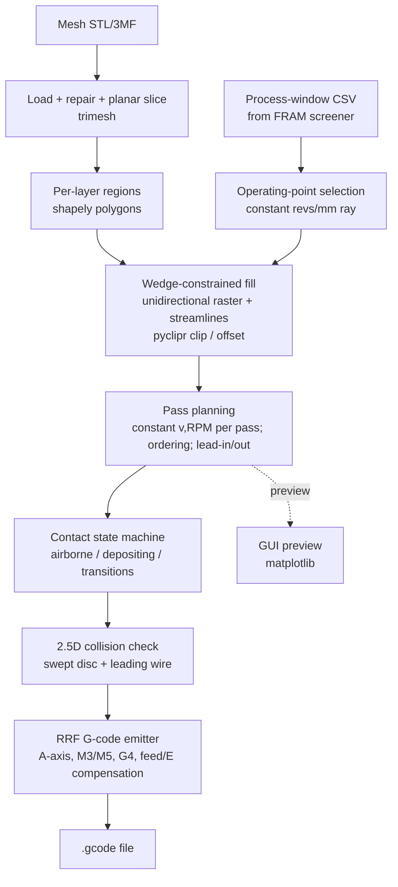
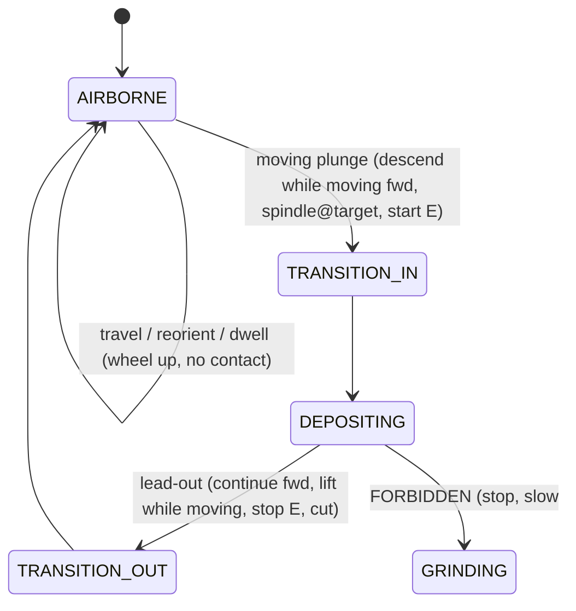

# Rotoforge Slicer — Software Specification

**Target builder:** Claude Code
**Author of spec:** derived from design sessions with Avery Lockwood and Michael Lynn(technical leads)
**Status:** implementation-ready v1
**Last updated:** 2026-06-29

---

## 0. What this is

A **custom slicer + toolpath generator** for the **Rotoforge** AFRB (Additive Friction Rotational Bonding / friction wire-deposition) machine. It converts a 3D mesh into **RepRapFirmware (RRF) G-code** that drives X, Y, Z, the rotary wheel axis (firmware letter **A**, functionally a **C** axis about Z), and the wire feeder **E**.

This is **not** a normal FFF slicer. The deposition physics and the machine kinematics impose hard constraints that reshape every stage of the pipeline. The single most important fact: **the rotary axis turns about Z, so slicing stays planar (flat Z layers)** — but the in-plane toolpaths are heavily constrained (directional tangential tool, limited rotation, no closed loops, a contact state machine that can *destroy* material if violated, and a constant-spindle-revs-per-mm requirement tied to an external process-window file).

The goal is to **build the new constraint/planning/emission layers on top of a proven open geometry stack**, and to **reuse the validated G-code primitives** from the existing generator (`afrb_playground_gui(2).py`) rather than reinventing them.

Deliverables: a Python package, a **user-friendly GUI**, a headless CLI, and **one-click executables for Windows and Linux**.

---

## 1. The machine (authoritative reference)

Source: `hardware_info.md`, `misc.md`. Everything here belongs in a config file (§7), not hard-coded.

### 1.1 Controller / firmware
- RatRig V-Core 3 (300 mm CoreXY), **Duet 3 MB6HC + Raspberry Pi 4** running DSF/DWC, **RRF 3.6+**.
- Machine name `duet3` (hostname `duet3.local`).
- Kinematics CoreXY (`M669 K1`). Machine mode **`M451` (FFF/printer mode)** — *not* CNC `M453`. `M3`/`M5` spindle still work in FFF mode.
- Cold extrusion/wire moves allowed (`M302 P1`) — there is no hotend-temp interlock.

### 1.2 Axes
| Axis | Firmware letter | Resolution | Notes |
|---|---|---|---|
| X | X | 80 steps/mm | CoreXY |
| Y | Y | 80 steps/mm | CoreXY |
| Z | Z | 400 steps/mm | 3 independent motors |
| Wire feed | **E** | **46.73 steps/mm** | recalibrated 2026-05-03 |
| Wheel angle (rotary about Z) | **A** | **26.667 steps/deg** | unlimited rotation in firmware; optical endstop `io4.in`; **active in deposition G-code** |

- **Build volume:** 380 × 235 × 250 mm (X × Y × Z).
- **The rotary axis is `A` in firmware but is conceptually a `C` axis (rotation about Z).** The slicer must treat the **output axis letter as a config value** (default `"A"` to match current firmware) so it can be renamed to `C` later in one place without touching planning code.

### 1.3 Spindle (SuperPID, closed-loop)
- `M3 S<rpm>` to run, `M5` to stop. Range **5000–30000 RPM** (`M950 R0 ... L5000:30000`). 0%PWM=5000, 100%=30000.
- **The SuperPID adjusts RPM at ~60 Hz.** The slicer **may change RPM only between moves (at segment boundaries), never mid-move** — G-code cannot chase the firmware's RPM slew inside a single move.

### 1.4 Thermal / cooling (driven via existing macros — call them, don't re-implement)
- **CPAP wheel cooling:** fan F0, `M106 P0 S0..255`. Full (255) during deposition. Primary job: keep aluminium from sticking to the wheel.
- **Hotshoe wire preheater:** heater H1 (tool 0), PT1000, **max ~350 °C** (CPAP-limited). Existing macros `Hotshoe_100C/200C/300C/OFF.g`.
- **Bed:** H0, ~110 °C typical, **max 150 °C**. Reduces forces, allows thicker layers.
- CPAP macros `CPAP_10/25/50/75/100pct.g`, `CPAP_OFF.g`. Spindle macros under `Spindle RPM/`.

### 1.5 Tool head geometry (drives toolpath constraints — see §4)
- **Wheel:** tungsten carbide, **~50 mm diameter**, but **deposition happens only under a ~1 mm-thick rim edge** that cuts into the surface. The 50 mm body is a **clearance/collision body**, not the contact.
- **Wire:** ~0.5 mm (24 AWG). Fed **from the front** (leading side, ahead of travel); **travel runs opposite the wire-infeed direction** (head advances toward the oncoming wire); the **bead trails out the back**; the **rim rotation drags the front-fed wire under** (a limited assist on top of the BMG push). The whole feeder+wheel assembly rotates on the A axis as a unit, so "wire-ahead" holds through curves.
- **Wire feeder:** dual-roller BMG-style remote drive, bowden delivery through armored conduit.

---

## 2. The process model (invariants Claude Code must enforce)

Source: `misc.md` (AFRB physics) + design sessions.

AFRB = frictional heating + plastic shear → **thixotropic flow of wire without melting**; bonds like forging (Al1100 as-printed YTS ~90 MPa, 3.6× feedstock). No shield gas.

These are **hard invariants**. Violating them either ruins the part or **grinds existing material away / damages the head**:

1. **Bead width ≈ 1.0 mm** (the rim edge). This is the **fill resolution**: raster pitch ≈ bead width, minimum resolvable feature ≈ 1 mm, wall offset ≈ 0.5 mm.
2. **Constant spindle-revs-per-mm is critical.** `revs_per_mm = RPM / traverse_mm_per_min`. This is exactly the screener's `n_over_v` column (§5). Holding it constant = staying on a fixed-slope ray through the origin of the RPM × traverse map.
3. **Two-state contact model, with a forbidden trap** (§4.4). A spinning wheel that is **in contact while not moving, moving too slowly, or not feeding wire is *subtractive*** — it grinds a 1 mm slot. All dwells (startup settle, between-pass spindle stabilization) must happen **airborne** (wheel lifted, spinning, not touching).
4. **Wire feed is monotonic.** `E` never decreases during a job. Wire separation between passes is **mechanical (cut) at a lead-out**, not retraction.
5. **Directional tangential tool.** The rim is directional; the A axis must point along the path tangent. Because the feeder+wheel rotate together, the leading wire always points along travel.
6. **Limited rotation.** The A axis is mechanically restricted to **±45° from home** (cooling duct + drive shaft block a full revolution in one pass). **Home heading = +Y**, and **reverse (−Y) deposition is impossible**. Depositable headings are the **+Y-centred ±45° wedge** (travel direction θ ∈ [45°, 135°] measured from +X). Closed perimeters are therefore impossible; fill is fundamentally **unidirectional**.
7. **Lift ≥ ~10 mm** above the last pass height between passes; **shortest practical deposit ~6 mm**; a **lead-out is required** so the wire can be cut after each pass.

> Note: `misc.md` lists an older "deposition direction −X, ±30° drift" parameter set. The **session-established constraint (+Y home, ±45° wedge) supersedes it.** Make `home_heading` and `wedge_half_angle` config values (defaults +Y / 45°) so the doc/firmware discrepancy is resolved in config, not code.

### 2.1 Default process parameters (Al1100-O, 0.50 mm wire) — all config
| Parameter | Default | Notes |
|---|---|---|
| Bead width | 1.0 mm | rim edge |
| Layer height | 0.12 mm | range 0.10–0.15 |
| Wire diameter | 0.50 mm | `wire_area = π(d/2)² = 0.19635 mm²` |
| Spindle RPM | from screener | per-region; not a single constant |
| CPAP | 255 (full) | during deposition |
| Bed | 110 °C | optional |
| Hotshoe | up to 300 °C | material-dependent |
| Airborne startup settle | ~10 s | spindle stabilize, wheel up |
| Between-pass spindle dwell | < 6 s | airborne |
| Inter-pass lift | ≥ 10 mm | above last pass height |
| Min deposit length | 6 mm | |
| Deposition rate | 4–12 mm³/s | sanity bound |

---

## 3. Architecture & technology choices

### 3.1 Pipeline



### 3.2 Library stack (exact, with rationale and licenses)

**Geometry core — the PySLM stack** (PySLM is an additive-manufacturing slicer built on exactly these; strong precedent):

| Package | Use | License |
|---|---|---|
| `numpy` | all tangent/heading/E/curvature math | BSD |
| `trimesh` (install `trimesh[easy]`) | mesh load, **repair** (`trimesh.repair`: fill_holes, fix_normals, fix_winding, fix_inversion), **planar slicing** via `mesh.section_multiplane(origin, normal, heights)` → per-layer `Path2D` | **MIT** |
| `shapely` (>=2.0) | 2D region representation, boolean/area ops | BSD |
| `pyclipr` | **Clipper2** polygon **offset + clip** (offset region for walls; clip raster/streamlines to region). Robust, fast, the de-facto AM choice | open (pybind) |
| `rtree`, `networkx`, `scipy` | trimesh dependencies for slicing/section path assembly | permissive |
| `pyyaml` | config | MIT |

**GUI + preview:**

| Package | Use | License |
|---|---|---|
| `PySide6` | user-friendly GUI (proper layouts, file dialogs, parameter panels, embeddable canvas) | LGPL |
| `matplotlib` | embedded per-layer 2D preview (top-down toolpaths + heading arrows + wedge) and optional 3D; embeds in Qt via `FigureCanvasQTAgg` | PSF/BSD |

**Packaging (build-time):** `pyinstaller`.

**Optional / swappable (do not require by default):**
- `meshlib` — higher-robustness repair (voxel remesh, tunnel fixing). **DUAL-LICENSED: free for non-commercial/educational, requires a paid commercial license otherwise.** Because Rotoforge has a commercial entity behind it, **do not make it a default dependency.** Expose it behind the geometry-backend interface (§3.3) so it can be enabled if a license is held.
- `pyvista` + `pyvistaqt` — nicer true-3D preview, but heavy PyInstaller bundle (VTK). Optional upgrade only.
- `manifold3d` — robust mesh booleans if support volumes are ever needed.

> **Packaging note on `pyclipr`:** prebuilt wheels historically cover Windows/macOS but **may build from source on Linux** (needs a C++ toolchain). The build/CI environment (§8) must have `build-essential`/`cmake`; once built there, PyInstaller bundles the compiled extension fine. Fallbacks if needed: `pyclipper` (Clipper1, has manylinux wheels) or `shapely` `.buffer()`/`.intersection()` for offset/clip.

### 3.3 Geometry backend abstraction
Define `geometry/backend.py::GeometryBackend` (ABC) with `load(path) -> Mesh`, `repair(mesh) -> Mesh`, `bounds(mesh) -> (min_xyz, max_xyz)` (so the planner picks layer Z heights without knowing the mesh type), `slice(mesh, z_heights) -> list[LayerRegions]`. Ship `TrimeshBackend` (default). Leave a `MeshLibBackend` stub. Planning/emission code depends only on the ABC and on shapely polygons — never on a specific mesh library.

---

## 4. Toolpath constraints — the core of the work

### 4.1 Heading ↔ A-axis mapping
- Home: `A = 0` ⟺ wheel heading **+Y**.
- Travel direction `θ` measured CCW from +X. +Y is θ = 90°.
- `A_deg = c_axis.invert_sign * (θ_deg - c_axis.home_heading_deg) + c_axis.home_offset_deg`
  - defaults: `home_heading_deg = 90` (+Y), `home_offset_deg = 0`, `invert_sign = +1` → `A_deg = θ_deg - 90`.
- **Wedge validation (hard):** reject any deposition heading with `abs(A_deg) > c_axis.wedge_half_angle_deg` (default 45). I.e. θ outside [45°, 135°] cannot be deposited.
- `invert_sign` and `home_offset_deg` must be **calibrated to the physical wheel** (match firmware `M569` direction). Provide a GUI/CLI "jog A and confirm heading" calibration aid.

### 4.2 Fill strategy
Because there are **no closed perimeters** and travel is **unidirectional within the +Y wedge**, fill is built from forward passes only:

- **Default — unidirectional raster** (`fill/raster.py`): hatch lines along +Y at pitch `= bead_width * (1 - overlap)` (overlap default 0.15). Each pass: plunge → deposit +Y → lead-out → lift → travel back (wheel up) to the next line's start. **No bidirectional/boustrophedon** (−Y is impossible).
- **Crosshatch across *layers*** (not within a layer): alternate heading within the wedge between layers (e.g. layer N at +Y+θ, layer N+1 at +Y−θ, with |θ| ≤ 45). Adjacent layers can cross at up to 90°.
- **Curved fill — streamlines** (`fill/streamline.py`): integrate a **+Y-biased guidance field** over the region and trace streamlines, then **clip to the region** with pyclipr. A streamline is depositable only if, **along its whole length**: (a) tangent stays in the wedge, (b) it is monotonic forward (no −Y reversal), (c) length ≥ `min_deposit_len`, and (d) it satisfies the curvature limit (§4.3) **at the pass's single speed**. Where a streamline violates a constraint, **split it** (airborne reorient between sub-passes).
- **Walls (optional):** offset the region inward by 0.5 mm (pyclipr) and deposit as **wedge-constrained partial arcs**, never closed loops. Default off in v1; raster-only is acceptable for v1.

### 4.3 Curvature limit
The wheel can't bend faster than the A axis can slew:
```
R_min = v / omega_max
  v          = traverse speed [mm/s]
  omega_max  = c_axis.max_speed_deg_s * pi/180   [rad/s]
```
A path point with local radius `R < R_min` cannot be followed at speed `v`. **Within a single deposition pass, v and RPM are both constant** (to hold revs/mm — see §4.5), so **the entire pass geometry must satisfy `R ≥ R_min(v)` everywhere**. Tighter curvature than that ⇒ either the whole pass uses a slower `v` (a different operating point), or the path is **broken** at the violating point with an airborne lift-reorient-replunge. `c_axis.max_speed_deg_s` is a measured config value.

### 4.4 Contact state machine (`toolpath/statemachine.py`)



**Invariant (must hold for every emitted move):**
> `in_contact  ⟺  (xy_speed ≥ v_grind_floor)  AND  (E feeding)`

- `GRINDING` is a planner error, not a state to emit. The emitter/validator must **prove no in-contact move violates the invariant**.
- `v_grind_floor` = **lower edge of the screener's stable traverse range** for the chosen operating ray (§5).
- **All dwells are airborne.** Startup settle (~10 s) and between-pass spindle stabilization (< 6 s) are emitted only in `AIRBORNE`.
- **Pass ends cannot decelerate to a stop in contact.** Exit is always `TRANSITION_OUT`: keep moving forward through a `lead_out_len` while lifting and stopping `E`; the wire is cut at the lead-out (mechanical/runout). Then lift to `travel_z`.
- **Entry** is `TRANSITION_IN`: a moving plunge — descend to layer Z while moving forward over a short lead-in, spindle already at target RPM, start `E`. (No material lead-in is needed; the short forward descent suffices.)

### 4.5 Pass planning (`toolpath/passplan.py`)
- Segment the per-layer fill into **passes**. **Each pass = one operating point: constant traverse `v` and constant `RPM`** (so revs/mm is constant within the pass). RPM is set **once, airborne, before the plunge**; never changed mid-pass.
- Regional variation (different `v`/RPM for different features) happens **between passes**, with the RPM hop emitted airborne at the boundary.
- **Pass ordering for collision/approach** (§4.6): order passes so the leading wire and disc body do not drive into previously-laid taller material. For raster, advance so that already-deposited adjacent beads stay **behind/beside** the contact, not ahead of the leading wire.
- Insert lead-in, lead-out, lifts, returns, and airborne dwells per the state machine.

### 4.6 Collision / approach (`toolpath/collision.py`)
- **The collision body is the 50 mm disc plus the leading wire**, not a point. Near the bottom the 25 mm-radius disc **hugs the surface for several mm fore and aft of contact** (≈ 0.5 mm proud at 5 mm away), and the fragile **0.5 mm wire leads** the contact.
- **v1 implementation — 2.5D height map:** maintain a height-field grid (cell ≈ bead width) of deposited material. For each planned move sample (a) the disc footprint as the line of disc-lowest-points along the heading over its fore/aft extent, and (b) the **leading-wire point** ahead of contact in the heading direction. Flag any cell where required clearance is violated. Resolve by **reordering passes, increasing lift, or inserting an airborne reorient**.
- **Approach rule:** never lead the wire/disc *into* a step-up taller than the fore/aft clearance allows; **lead away from existing tall material.** Encode as a constraint on pass order and on plunge/lift placement.
- Full 3D swept-body-vs-mesh checking is a **future upgrade**; 2.5D is sufficient and fast for v1.

---

## 5. Process-window handshake (`process/screener.py`)

The **FRAM Rim+Jet Process Window Screener** (`fram_rim_jet_process_window_screener_5_.html`, "Export CSV" button) is the **interface spec** between process tuning and the slicer. The slicer **consumes its CSV**; it does not re-derive process physics.

### 5.1 CSV schema (exact column order from the screener's `makeCsv()`)
```
rpm, traverse_mm_min, pass, category, contact_model, T_AZ_C, torque_Nm, power_kW,
gross_heat_input_J_mm, net_AZ_heat_input_J_mm, Fz_N, A_mech_mm2, A_thermal_mm2,
pressure_MPa, p_over_sigma, tau_MPa, tau_coul_MPa, tau_cap_MPa, sigma_flow_MPa,
regime, thermal_dwell_s, shear_time_s, surface_speed_m_s, strain_rate_s_1, eq_strain,
work_density_MJ_m3, feed_area_mm2, feed_speed_mm_min, feed_ratio_phi, n_over_v,
jet_Ueff_m_s, jet_Re, jet_h_W_m2K, jet_total_W, jet_AZ_credit_W, AZ_cooling_fraction, reasons
```
Columns the slicer needs: **`rpm`, `traverse_mm_min`, `pass` (truthy), `n_over_v` (= rpm/traverse = revs/mm), `feed_speed_mm_min` (wire), `feed_ratio_phi`, `T_AZ_C`, `torque_Nm`, `power_kW`, `category`.** Ignore the rest (keep for diagnostics/logging).

### 5.2 Operating-point selection algorithm
1. Parse CSV; keep rows with `pass` truthy.
2. Choose a **constant revs/mm target** `nv*`:
   - **auto (default):** pick the `n_over_v` value whose stable cells span the **widest contiguous traverse range** (the ray through the largest stable run → most regional flexibility), OR
   - **manual:** user supplies `nv*`; select stable cells with `abs(n_over_v - nv*) ≤ nv_tol`.
3. From the selected cells derive the **feasible traverse band** `[v_min, v_max]` (mm/min) and set `v_grind_floor = v_min`.
4. **Per pass**, pick `v ∈ [v_min, v_max]` (default: a single nominal `v`; optionally slower `v` for passes containing tighter curvature — but a slower `v` is a *different operating point* and must come from a cell on the same ray). Then `RPM = round(nv* * v)`, clamped to [5000, 30000]; the matching cell also gives the **wire feed** `feed_speed_mm_min` and validated `feed_ratio_phi ∈ [phiMin, phiMax]`.
5. Emit `M3 S<RPM>` at the pass boundary (airborne). The cell **fully determines** `(RPM, traverse, wire-feed)` for that pass.

### 5.3 Extrusion coupling (`process/extrusion.py`)
The screener-consistent wire-to-travel ratio (volumetrically correct, lands Φ in band):
```
E_per_path_mm = cell.feed_speed_mm_min / cell.traverse_mm_min     # wire mm per XY-path mm
```
Per deposition segment of XY length `L_xy`: `dE = E_per_path_mm * L_xy` (relative extrusion, `M83`; monotonic).
Manual overrides (match the existing tool's modes):
- `"x"`: `dE = k * L_xy` (k default 1.0 — the historical ~1:1).
- `"volume"`: `dE = (bead_width * layer_height / wire_area) * L_xy`.
Default = **screener-derived**; fall back to `"x"`/`"volume"` only when no CSV is supplied.

---

## 6. RRF G-code emission (`emit/rrf.py`, `emit/templates.py`)

Reuse the **validated primitives** from `afrb_playground_gui(2).py` (params `feed_travel, feed_z, feed_dep, spindle, fan, travel_z, dwell_ms, runout, retract`; modes `x`/`volume`). **Milestone M2 must reproduce the existing `afrb_yline_*` outputs** (straight Y-line, 2-wall, given lh/feed) before any new features are trusted.

### 6.1 Output structure
- **Preamble (editable template):** units `G21`, absolute `G90`, relative E `M83`, reset `M220 S100` / `M221 S100`, spindle off `M5`, then **call the user's existing macros** for temps/cooling (`M98 P"Hotshoe_300C.g"`, `M98 P"CPAP_100pct.g"`, bed `M140 S110`/`M190 S110`), and homing. **Prefer calling tuned macros over re-emitting tuned values.**
- **Body:** per layer, per pass, the state-machine sequence:
  1. Airborne reposition: `G0 X.. Y.. <A>.. F<travel>` at `travel_z`, A = pass start heading.
  2. RPM set if changed: `M3 S<rpm>` (airborne).
  3. Optional airborne dwell: `G4 P<ms>` (wheel up).
  4. `TRANSITION_IN` moving plunge: `G1` forward + down to layer Z, begin E.
  5. `DEPOSITING`: `G1 X.. Y.. <A>.. E<dE> F<feed>` per segment (curve = short-segment polyline, A per segment, R≥R_min held).
  6. `TRANSITION_OUT`: `G1` forward through `lead_out_len` while lifting, E stops at cut point; wire cut (runout). Then `G0 Z<travel_z>`.
  7. Travel (wheel up) to next pass.
- **Postamble:** `M5`, `M98 P"CPAP_OFF.g"`, `M98 P"Hotshoe_OFF.g"`, bed off, park, `M84`.
- Output axis letter for the rotary comes from `config.machine.rotary_axis_letter` (default `"A"`).

### 6.2 Feedrate semantics — **constant XY surface speed (known firmware-integration risk)**
Revs/mm depends on the **true XY surface speed**; the A-axis rotation must **not** distort it. RRF's treatment of feedrate for a combined linear+rotary move **must be confirmed on this firmware** (it differs across versions/configs). Implement in this order:

1. **Preferred — firmware config:** if RRF can be configured so the rotary `A` axis is **excluded from the feedrate/extrusion-length computation**, then `F` directly sets XY speed. Document the exact `M584`/related settings used.
2. **Always-valid — per-segment F compensation:** characterize RRF's combined-move distance `D_rrf` for a calibration move (command a known `ΔX,ΔY,ΔA`, measure realized XY speed via timing/DWC), then for each segment emit
   ```
   F = target_xy_speed * (D_rrf / L_xy)
   ```
   so realized XY speed = target regardless of `ΔA`.

**This calibration/validation is a required step**, not optional. `E` is already tied to XY length (§5.3), so it is unaffected as long as relative E with explicit per-segment `dE` is used.

### 6.3 Hard emitter validations (fail the build if any trip)
- Every deposition heading: `abs(A_deg) ≤ wedge_half_angle`.
- Every in-contact move: `xy_speed ≥ v_grind_floor` **and** `dE > 0` (contact invariant).
- No `G4` dwell while `Z` is at deposition height (all dwells airborne).
- `E` monotonic non-decreasing across the whole file.
- Per pass: single RPM, single traverse; `R ≥ R_min(v)` at every vertex.
- All coordinates within build volume; A within configured limits.

### 6.4 Optional
- Direct upload to DWC (`POST` to `http://duet3.local`) behind a clearly-labeled button; **off by default** (the user uploads manually). Producing the `.gcode` file is the core deliverable.

---

## 7. Configuration (`config/machine_duet3.yaml`, loaded by `config.py` into dataclasses)

```yaml
machine:
  name: duet3
  rotary_axis_letter: A          # change to C after firmware rename
  build_volume_mm: [380, 235, 250]
  steps:
    x: 80; y: 80; z: 400
    e_per_mm: 46.73
    a_per_deg: 26.667
  feedrate_mode: per_segment_compensation   # or: firmware_excludes_rotary
c_axis:
  home_heading_deg: 90           # +Y
  home_offset_deg: 0
  invert_sign: 1                 # calibrate to M569 direction
  wedge_half_angle_deg: 45
  max_speed_deg_s: 0             # MEASURE and set; drives R_min
spindle:
  rpm_min: 5000
  rpm_max: 30000
process:
  bead_width_mm: 1.0
  layer_height_mm: 0.12
  wire_diameter_mm: 0.50
  raster_overlap: 0.15
  min_deposit_len_mm: 6.0
  inter_pass_lift_mm: 10.0
  lead_out_len_mm: 4.0
  travel_z_mm: 10.0
  startup_settle_ms: 10000
  spindle_dwell_ms: 2000         # airborne, < 6000
  cpap_deposit: 255
  bed_temp_c: 110
  hotshoe_macro: "Hotshoe_300C.g"
extrusion:
  mode: screener                 # screener | x | volume
  x_ratio: 1.0
screener:
  csv_path: ""                   # FRAM screener export
  revs_per_mm_mode: auto         # auto | manual
  revs_per_mm_target: 0          # used if manual
  revs_per_mm_tol: 5.0           # rpm/(mm/min) tolerance band
gcode:
  preamble_macros: ["Hotshoe_300C.g", "CPAP_100pct.g"]
  postamble_macros: ["CPAP_OFF.g", "Hotshoe_OFF.g"]
  use_relative_e: true
```

---

## 8. Packaging — one-click executables (Windows + Linux)

- **Tool:** PyInstaller. **One file** per OS for true one-click distribution (`--onefile`), launched by double-click. (Offer `--onedir` as a faster-startup alternative.)
- **PyInstaller cannot cross-compile** — build the Windows `.exe` on Windows and the Linux binary on Linux. Provide:
  - `build/rotoforge_slicer.spec` (PyInstaller spec).
  - `build/build_windows.bat` and `build/build_linux.sh`.
  - `build/hooks/` for hidden imports & data files: `trimesh` (data files / `collect_all`), `shapely`, `pyclipr` (compiled extension), `rtree` (bundled `libspatialindex`), `matplotlib` (backends + data), `PySide6` (Qt plugins — use `--collect-all PySide6` or the official hook). Test the frozen binary; trimesh/shapely/rtree/Qt commonly need explicit `collect_*`.
  - `.github/workflows/build.yml` — CI **matrix `windows-latest` + `ubuntu-latest`**, install deps (Linux runner has a compiler for `pyclipr`), run PyInstaller, upload both executables as artifacts. This is the most reliable way to produce both binaries.
- Outputs: `RotoforgeSlicer.exe` (Windows), `RotoforgeSlicer` (Linux, `chmod +x`).
- **Optional polish:** Inno Setup installer (Windows) / AppImage (Linux). Not required for v1.

---

## 9. GUI (`gui/app.py`, PySide6) — user-friendly

Single window, three regions:

1. **Inputs panel (left):**
   - "Open mesh…" (STL/3MF), "Open process-window CSV…" (FRAM export), "Load machine config…".
   - Key process fields (layer height, bead width/overlap, fill mode raster|streamline, crosshatch on/off) with sensible defaults from config; an "Advanced" expander for the rest.
   - A read-out of the **selected operating point** once the CSV is loaded: revs/mm ray, `[v_min, v_max]`, chosen `v`, derived RPM, Φ, predicted torque/power/T_AZ.
   - **A-axis calibration aid:** "Jog A / confirm heading" to set `invert_sign`/`home_offset`.
2. **Preview (center, matplotlib canvas):**
   - Per-layer **top-down** view: deposited passes colored by pass, **heading arrows**, the **±45° wedge** drawn at the part, lifts/travels dashed, lead-outs marked.
   - Layer slider; play/scrub. Optional 3D toggle (matplotlib 3D; pyvista if the optional dep is present).
   - **Validation overlay:** highlight any wedge/curvature/collision/contact violations in red with tooltips.
3. **Actions (bottom):** "Slice", progress, "Save G-code…", optional "Upload to duet3.local". A log pane showing validation results (§6.3).

Keep it genuinely usable: non-blocking slicing (worker thread), clear error messages, remembers last config/paths.

> **Lightweight fallback:** if Qt packaging proves troublesome on a target OS, a **Tkinter** GUI (stdlib, trivial to freeze) with the same matplotlib canvas (`FigureCanvasTkAgg`) is an acceptable substitute. Prefer PySide6 for UX; keep the GUI layer thin so either can wrap the same `pipeline.py`.

---

## 10. Module layout (build to this)

```
rotoforge_slicer/
  pyproject.toml
  requirements.txt
  README.md
  config/machine_duet3.yaml
  rotoforge_slicer/
    __init__.py
    config.py                 # YAML -> validated dataclasses
    pipeline.py               # mesh -> layers -> fill -> passes -> collision -> gcode
    cli.py                    # headless: in mesh + csv + config -> out .gcode
    geometry/
      backend.py              # GeometryBackend ABC
      trimesh_backend.py      # load, repair, section_multiplane
      slicing.py              # Path2D -> shapely region polygons per layer
    fill/
      wedge.py                # heading<->A, wedge validation
      raster.py               # unidirectional +Y raster
      streamline.py           # +Y-biased guidance-field streamlines, pyclipr-clipped
      curvature.py            # R_min(v), polyline curvature, path splitting
    toolpath/
      statemachine.py         # states + contact invariant
      passplan.py             # constant-(v,RPM) passes, ordering, lead-in/out, lifts
      collision.py            # 2.5D height-map swept disc + leading wire
    process/
      screener.py             # CSV parse, revs/mm ray, operating points
      extrusion.py            # E per path-mm (screener | x | volume)
    emit/
      rrf.py                  # GCodeEmitter + feed/E compensation + validations
      templates.py            # preamble/postamble (macro calls)
    gui/
      app.py                  # PySide6 main window
      preview.py              # matplotlib per-layer + 3D
      widgets.py
  build/
    rotoforge_slicer.spec
    build_windows.bat
    build_linux.sh
    hooks/
  tests/
    test_wedge.py  test_curvature.py  test_screener.py
    test_statemachine.py  test_emit_validations.py
    test_reproduce_yline.py            # M2 parity with afrb_yline_*
  .github/workflows/build.yml
```

Key signatures (illustrative):
```python
# geometry/backend.py
class GeometryBackend(ABC):
    def load(self, path: str) -> "Mesh": ...
    def repair(self, mesh) -> "Mesh": ...
    def bounds(self, mesh) -> tuple[tuple[float, float, float], tuple[float, float, float]]: ...
    def slice(self, mesh, z_heights: list[float]) -> list["LayerRegions"]: ...

# fill/wedge.py
def heading_to_a_deg(theta_deg: float, cfg: CAxisCfg) -> float: ...
def in_wedge(a_deg: float, cfg: CAxisCfg) -> bool: ...

# fill/curvature.py
def r_min(v_mm_s: float, omega_max_deg_s: float) -> float: ...
def split_on_curvature(path_xy, v_mm_s, cfg) -> list[Path]: ...

# process/screener.py
@dataclass
class OperatingPoint:
    revs_per_mm: float; v_min: float; v_max: float
    def rpm_for(self, v_mm_min: float) -> int: ...
    feed_speed_mm_min: float; phi: float; torque_Nm: float; power_kW: float; t_az_c: float
def select_operating_point(csv_path: str, cfg) -> OperatingPoint: ...

# toolpath/statemachine.py
def assert_contact_invariant(move) -> None:   # raises on GRINDING

# emit/rrf.py
class GCodeEmitter:
    def emit(self, plan: "ToolpathPlan", cfg) -> str: ...   # runs §6.3 validations
```

---

## 11. Build order (milestones)

- **M0 — skeleton:** package, config loader, CLI stub, requirements.
- **M1 — geometry:** load + repair + `section_multiplane` slicing → shapely regions; matplotlib preview of layer polygons.
- **M2 — straight fill + emitter parity:** wedge raster + heading→A + straight-pass emitter; **reproduce `afrb_yline_*`** and diff against the existing files. Implement §6.2 feedrate calibration here.
- **M3 — process window:** screener CSV → operating-point selection → E coupling → per-pass RPM placement.
- **M4 — contact & collision:** state machine + moving plunge/lift + lead-out/wire-cut + airborne dwells + 2.5D collision/approach. Wire-the §6.3 validations.
- **M5 — curved fill:** +Y-biased streamlines + curvature breaking + cross-layer crosshatch.
- **M6 — GUI:** PySide6 window + per-layer preview + validation overlay + save/upload.
- **M7 — packaging:** PyInstaller specs + per-OS build scripts + CI matrix → Windows/Linux one-click executables.

Each milestone ends with tests green and a runnable artifact.

---

## 12. Acceptance criteria

1. Given a test STL + a FRAM screener CSV + the config, the CLI emits valid RRF G-code that passes all §6.3 validations.
2. **Revs/mm is constant within every pass**, and equals the selected ray (assert from emitted RPM/feed).
3. **No emitted in-contact move violates the contact invariant**; **no dwell occurs in contact**; **E is monotonic**.
4. **Every deposition heading is within ±45° of +Y**; every pass satisfies `R ≥ R_min(v)`.
5. M2 parity: emitter reproduces the existing `afrb_yline_*` G-code for the same inputs.
6. The GUI loads a mesh, previews layers with heading arrows + wedge, flags violations, and saves G-code.
7. `RotoforgeSlicer.exe` and the Linux binary launch by double-click on a clean machine and run a slice end-to-end.

---

## 13. Open items to confirm during build (don't block; flag in README)
- `c_axis.max_speed_deg_s` — **measure** (drives R_min).
- RRF combined linear+rotary **feedrate behavior on this firmware** (§6.2) — calibrate.
- `invert_sign`/`home_offset_deg` for the A axis — calibrate against physical wheel heading.
- Effective bead width vs the 1 mm rim under real squeeze-out — calibrate `bead_width`.
- The existing `afrb_yline_*` A-axis usage pattern, lead-out, and track spacing — read the files in `/gcodes/` and match in M2.
